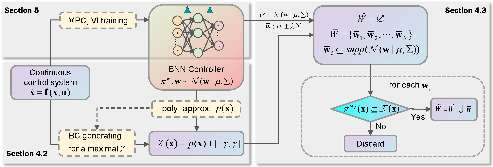

# Safety Verification of Nonlinear Systems with Bayesian Neural Network Controllers

This repository is the official implementation of [Safety Verification of Nonlinear Systems with Bayesian Neural Network Controllers]
, and the supplemental material sees the supplemental_material_BNN_Verification.pdf.
## Requirements

To install requirements:

```setup
pip install -r requirements.txt
```
## Files

The file information in the code is as follows:
* ```\data``` Containing pre-trained BNN controller weights and abstract polynomial controllers.
* ```BNN_controller.py ``` BNN controller model.
* ```benchmark.ipynb``` Environment description and run information for each benchmark experiment.
* ```safeWeight.py``` Implementation of computing BNN safe weight set.

## Evaluation

To train the model(s) in the paper, run this command:

```train
python env_test.py --env lds --isfirst 1 --xmargin 0.0005 --wmargin 0.1 --u 0.5 --degree 2 --num 1000
python id_test.py --env 9 --isfirst 1 --xmargin 0.001 --wmargin 0.5 --u 0.1 --degree 2 --num 1000
```
* ```lds,id``` Name of the running benchmark experiment
* ```isfirst``` 1 means all layers are Bayesian weights, 0 means only the second layer is Bayesian weights
* ```xmargin``` Input interval length
* ```wmargin``` Wnput interval length
* ```u,degree``` Polynomial controller radius and degree
* ```num```  Number of weights sampled
